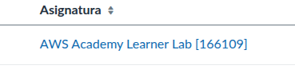
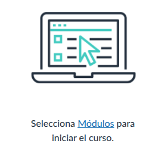
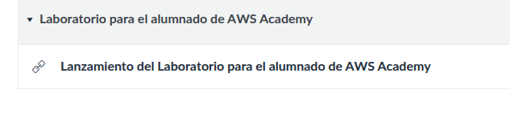
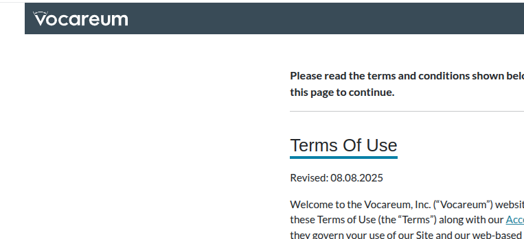
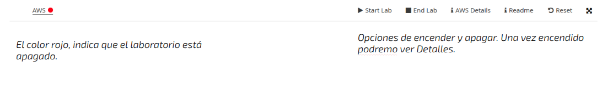
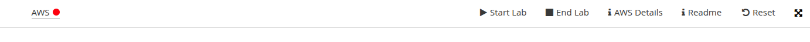
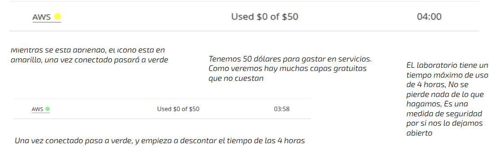
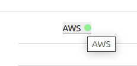
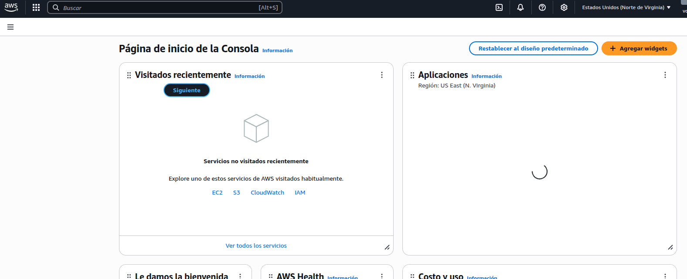

+++
title = 'Acceso a Learner Lab'
date = 2024-10-15T07:04:49+02:00
draft = false
icon = "fas fa-sign-in-alt"
weight = 10
description = "Cómo acceder a learner lab"
+++



- Acceder al entorno de prácticas de AWS
- Comprender cómo iniciar y detener el laboratorio
- Identificar los elementos principales del entorno

---

# 🚀 Acceso rápido al laboratorio

Sigue estos pasos para entrar en AWS:

---

## Paso 1: Accede la plataforma

1. Entra en la plataforma del curso 
2. Busca el módulo de AWS localizando  el enlace del curso:
 
   
 
5. Una vez dentro del curso, accede a los **Módulos**

 
 
6. Busca la opción de **Laboratorio para alumnos ...** Presiona en la opción **Lanzamiento ...** ella
 
  
 
8. Entonces se abrirá una ventana de **Vocareum** que es una app que gestiona los laboratorios. 
La primara vez que accedas aparecerán los **términos de uso** que obligatoriamente hay que aceptar para poder entrar en el laboratorio.

9. Una vez aceptados aparecerá el típico incono de **Vocareum** mientras se carga (son segundos)

## ▶️ El entorno del laboratorio

El laboratorio tiene una serie de secciones.

Presionamos Start Lab para arrancar el laboratorio. El proceso puede tardar como 3 minutos

Durante el procese vemos cómo el color del icono AWS torna amarillo 

**Learner Lab**

> ️ El entorno se está preparando automáticamente

---

## 🔐 Paso 3: Abre AWS

Cuando el laboratorio esté listo:

1. Hacemos click en el icono verde AWS y se abre **AWS Console**

✔ Se abrirá una nueva pestaña  
✔ Ya estarás autenticado automáticamente

---

#  Cómo funciona el acceso


-  No necesitas usuario ni contraseña
-  El acceso lo gestiona el laboratorio
-  Ya tienes permisos configurados  
  

---

# ️ Tiempo del laboratorio


- El laboratorio tiene duración limitada de 4 horas
- Puede detenerse si no se usa
- Guarda tu trabajo frecuentemente  
  

---

#  Uso responsable


- Usa solo los recursos necesarios
- Borra lo que no utilices
- Sigue las instrucciones de cada práctica  
  

---

#  Qué deberías ver

Una vez dentro de AWS:

- Consola principal
- Servicios (EC2, S3, Lambda…)
- Región ya configurada

---

