+++
title = 'Práctica 1: EC2'
date = 2024-10-15T07:04:49+02:00
draft = false
weight = 10
icon="fas fa-server"
description = "Crear una EC2 básica y desplegar un Laravel"
+++



Crear una instancia EC2 en AWS
Conectarse mediante SSH
Preparar el entorno (LAMP)
Desplegar una aplicación Laravel

---

## Práctica 1: Desplegar Laravel en EC2

En esta práctica vamos a crear un servidor web en AWS.
Una vez creada la instancia, instalaremos las librerías necesarias y desplegaremos una aplicación Laravel.



```plantuml
left to right direction

!define AWSPUML https://raw.githubusercontent.com/awslabs/aws-icons-for-plantuml/v14.0/dist

!include AWSPUML/AWSCommon.puml
!include AWSPUML/Compute/EC2.puml

actor User

rectangle "Git Repository\n(GitHub)" as Git

rectangle "AWS Cloud" {
EC2(ec2, "EC2 Laravel", "Apache + PHP")

note right of ec2
- Librerías de php para laravel
- Composer install
- Node build
- Migraciones
  end note
  }

Git --> ec2 : git clone
User --> ec2 : HTTP Request
ec2 --> User : HTML Response

```

Para ello realizaremos las siguientes acciones:


1. **Crear** una instancia EC2.
2. **Conectarnos** a ella.
3. **Instalar** el stack _Apache + PHP_ con _las librerías_ necesarias para ejecutar Laravel.
4. **Instalar** _Composer y Node.js_ para gestionar dependencias y compilar assets.
5. **Adaptar la configuración de Apache** para servir correctamente el proyecto Laravel.
6. **Clonar el proyecto** de git, instalar dependencias, generar los assets y ejecutar las migraciones.
7. _**Desplegar la aplicación y verificar su funcionamiento**_.
   

A continuación vamos paso a paso en cada una de estas 7 acciones

### Crear instancia EC2

1. Primero seleccionamos este servicio de nuestra consola de servicios web

  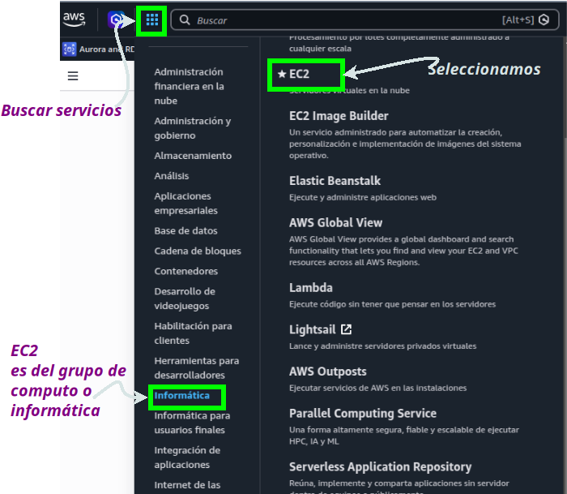

2. A continuación revisamos la ventana **dasboard de EC2** que nos sale (se puede ver un poco las opciones), pero la que nos interesa, es *
  *crear una instancia EC2**

  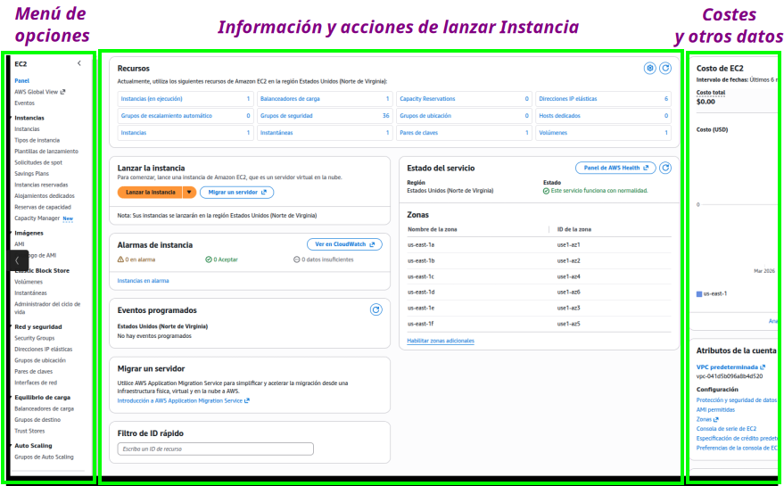
* 
3.  Buscamos el botón **Launch Instance** para crear una instancia EC2
 
    La mejor opción (la menos la más rápida)es hacerlo a través del botón “Launch
     Instance”. Lo podemos encontrar en esta página de la EC2
 
   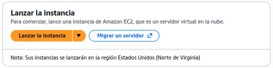
 
* Entonces nos sale una ventana de opciones donde deberíamos de entender cada una de ellas, en la mayoría de los
  casos dejaremos la opción por defecto, pero las vamos comentando. Vamos a configurar los siguientes elementos
> * Nombre de la instancia
> * AMI base y artquitectura de la instancia EC2
> * Tipo de instancia
> * Pareja de claves (pública/privada) para acceder
> * Configurar Red y grupos de seguridad
> * Almacenamiento que utilizará la instancia
> * Detalles avanzados

Nombre de la instancia

El nombre **no es obligatorio** y tiene una función **identificativa** para nosotros, ya que **AWS utiliza identificadores únicos (Instance ID) para cada instancia.**

El nombre incluso se puede repetir, y podemos añadir **pares clave:valor como etiquetas** para identificarlas, clasificarlas o filtrarlas, especialmente cuando tenemos muchas instancias.

No es un atributo obligatorio, pero sí muy recomendable. En nuestro caso pondremos **laravel-aws**


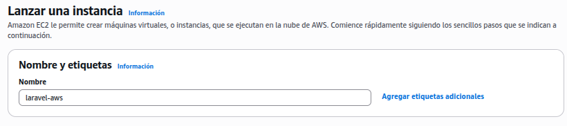


AMI base y arquitectura de la instancia EC2

Por un lado, tenemos que seleccionar **la AMI (Amazon Machine Image)**. **La AMI** no es exactamente una ISO, sino una imagen base a partir de la cual vamos a crear nuestra instancia EC2, que **incluye un sistema operativo**.

También **podemos crear nuestras propias AMI** a partir de una instancia ya configurada, lo que nos permite reutilizar configuraciones.

Por otro lado, especificaremos **la arquitectura (x86 o ARM)** que vamos a utilizar en la instancia EC2.

Aquí debemos tener **muy en cuenta la finalidad de la máquina** y ser conscientes del **coste** que puede tener cada opción.

Para nuestro caso usaremos una **AMI de Ubuntu**, ya que vamos a montar un entorno de servidor web y _además está incluida en la capa gratuita del laboratorio_.

En la arquitectura seleccionaremos **x86**.**ARM** suele ser más barato pero puede dar problemas de compatibilidad


  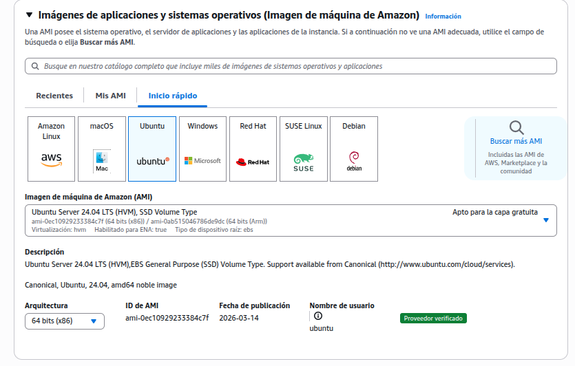


Tipo de instancia

El tipo de instancia define los recursos de la máquina (CPU, memoria, etc.). Está identificado por tres partes:

familia.generación.tamaño

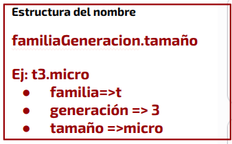

En nuestro caso, vamos a crear una instancia de tipo t3.micro, que cuenta con 1 vCPU y 1 GiB de RAM.

Más que suficiente para nuestro objetivo.


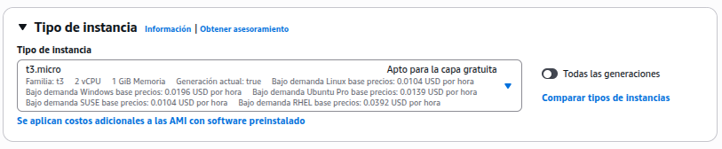  

Pareja de claves (pública/privada) para acceder

En este paso tenemos que seleccionar el par de claves que vamos a utilizar para nuestra instancia. La clave pública se asocia a la instancia.

Podemos generar un nuevo par de claves SSH o utilizar claves SSH ya creadas y asociadas a nuestra cuenta en AWS Learner Lab. Más adelante veremos cómo descargar estas claves.

En este ejemplo vamos a utilizar la clave pública **vockey**, que está asociada a nuestra cuenta en AWS Learner Lab.

La clave privada la descargaremos posteriormente desde la plataforma, para poder conectarnos por SSH a la instancia EC2.


sin la clave privada no podrás acceder a la instancia


  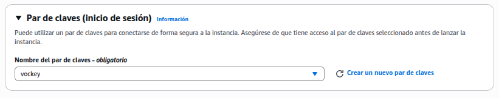

 
Configurar Red y grupos de seguridad

EEn este paso podemos configurar la red VPC (Virtual Private Cloud) donde se va a crear la instancia, así como la subred y otros parámetros de red.

En esta práctica no vamos a modificar ninguno de estos valores, por lo que utilizaremos la configuración por defecto.

Es importante entender que una instancia EC2 siempre debe estar dentro de una red (VPC); no puede existir de forma aislada.

---

En este mismo paso también configuramos las reglas del grupo de seguridad.

Podemos crear un nuevo grupo de seguridad o utilizar uno existente. En este ejemplo vamos a crear uno nuevo y añadiremos las siguientes reglas para permitir tráfico:

- **SSH** → TCP, puerto 22, origen: 0.0.0.0/0
- **HTTP** → TCP, puerto 80, origen: 0.0.0.0/0
- **HTTPS** → TCP, puerto 443, origen: 0.0.0.0/0

Estas reglas determinan qué tráfico puede entrar a nuestra instancia. Estas reglas pueden ser modificadas una vez que la instancia esté creada

  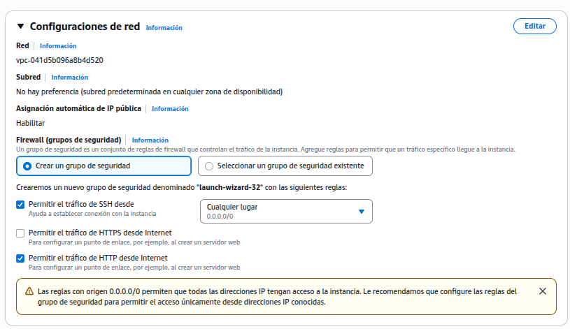


Almacenamiento que utilizará la instancia

En este paso configuramos qué almacenamiento utilizará la instancia EC2 que estamos creando.

Por defecto se utiliza un volumen EBS (Elastic Block Store), un servicio de almacenamiento en bloques que actúa como disco duro de la instancia y cuyos datos persisten aunque la instancia se detenga. 

En este ejemplo vamos a modificar el tamaño del disco y utilizaremos un volumen SSD de 16 GB. EBS es el disco duro de la máquina; EFS o S3 serían almacenamientos externos.

---

Recientemente también tenemos la posibilidad de añadir sistemas de almacenamiento adicionales (como EFS o S3), que permiten guardar datos fuera de la propia instancia.

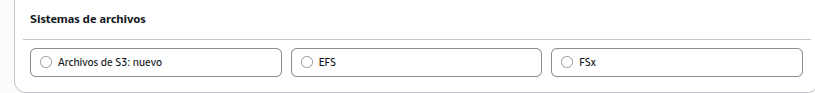

---

Para nuestro objetivo elegimos 16 GB, ya que vamos a gestionar imágenes (por ejemplo, los avatares de los usuarios), lo que nos proporciona un espacio holgado para nuestra aplicación.


  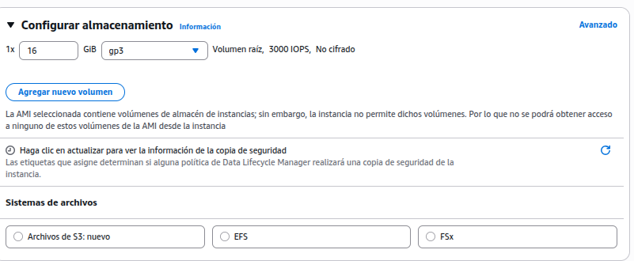


Detalles avanzados

En esta sección hay muchos parámetros que podríamos configurar, pero en nuestro caso no vamos a modificar ninguno.

---

Un ejemplo interesante de personalización es el campo **User data**, donde podemos indicar comandos o un script que se ejecutará automáticamente al iniciar la instancia.

Esta opción nos permite preparar la máquina para que arranque directamente con el estado deseado (software instalado, configuración aplicada, etc.).

---

En la próxima práctica crearemos un script con todas las acciones que vayamos realizando en esta práctica, para automatizar el proceso.


  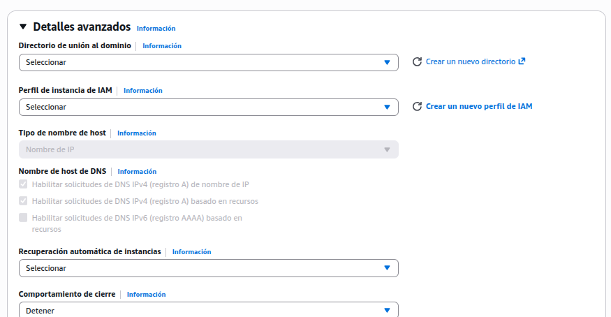

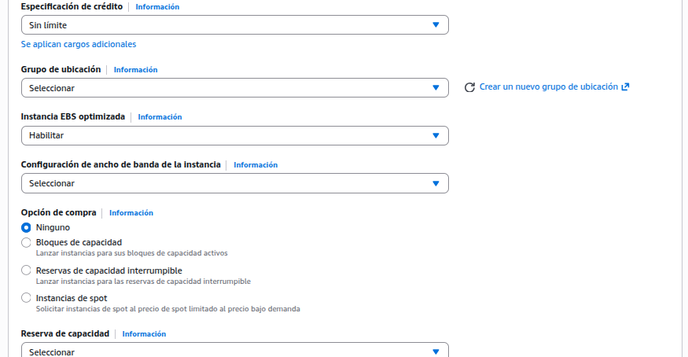

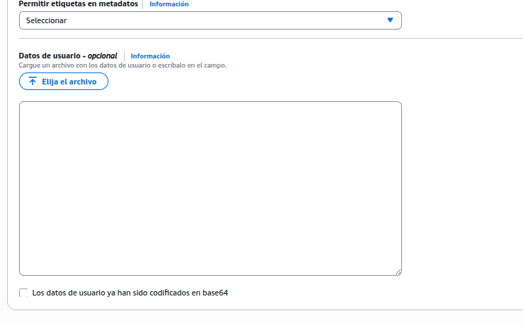


Lanzar la instancia

Una vez configuradas todas las opciones, en la parte derecha veremos un **resumen** de la configuración y el botón **Lanzar instancia**, que debemos pulsar.

---

Podemos elegir el número de instancias que queremos crear, pero hay que tener cuidado en el entorno de AWS Academy.

Si lanzamos demasiadas instancias, nuestra cuenta puede quedar bloqueada y sería necesario solicitar su desbloqueo.

👉 Recomendación: lanzar siempre **1 única instancia** para esta práctica.

Verifica que el número de instancias sea correcto antes de continuar.


  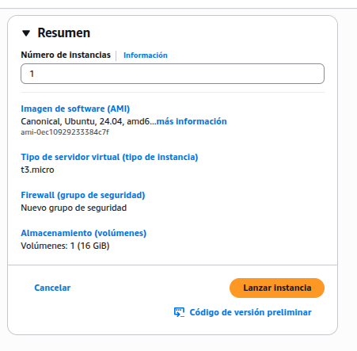


El proceso se lanza y en pocos segundos ya tenemso nuestra instancia disponible



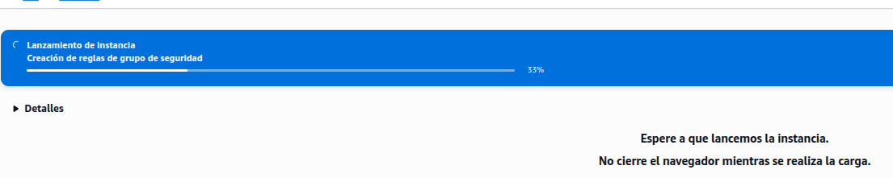
---
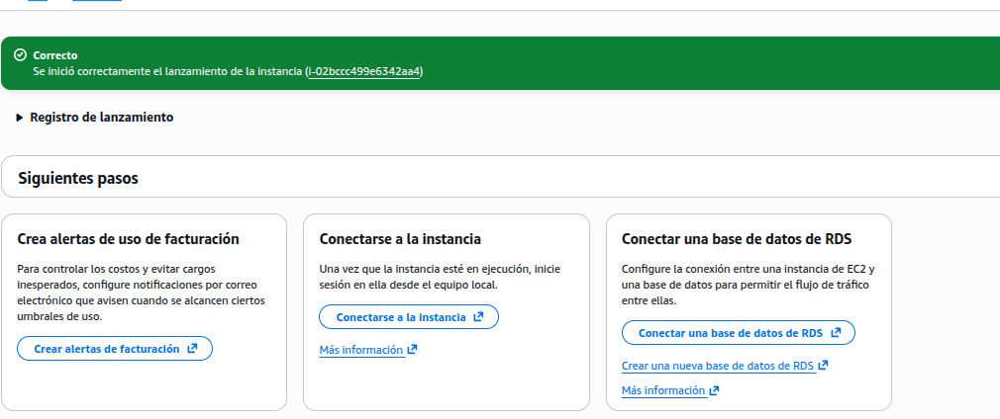

