+++
title = 'Instalaciones en  EC2'
date = 2024-10-15T07:04:49+02:00
draft = false
weight = 20
icon= "fas fa-cogs"
description = "Trabajar con la EC2"
+++



Conectarse
Configurar nuestro sistema
Desplegar un proyecto laravel
Compartir ficheros entre la EC2 y nuestro equipo (fillezilla, phptorm o viusal code)

---
## Accedemos a la máquina

Verificamos en la consola de AWS que nuestra instancia está disponible.

Para ello, volvemos al servicio EC2 y accedemos al listado de instancias (la página **dashboard** de instancias:





---

En el panel de instancias podemos ver **todas las instancias creadas** y **su estado** actual.


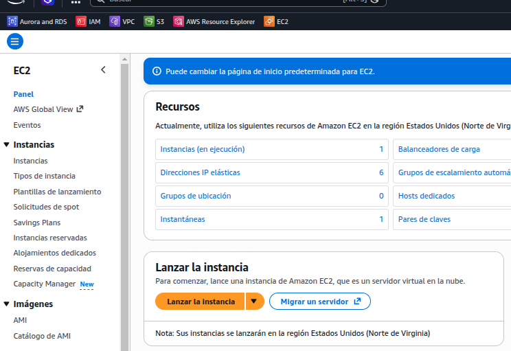


---

Seleccionamos la instancia para ver su información detallada:


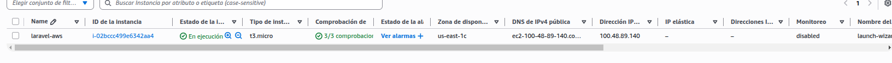


---

Desde aquí podemos consultar datos importantes como:

- Dirección IP pública
- Dirección IP privada
- Estado de la instancia
- Tipo de instancia
- Zona de disponibilidad

También podemos acceder a todos los detalles haciendo clic sobre la instancia.


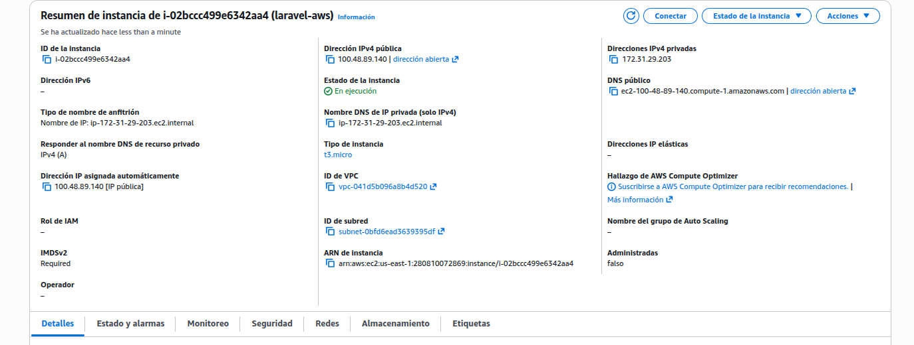


---

Estados de una instancia

Una instancia EC2 puede estar en diferentes estados:

- **pending** → iniciándose
- **running** → en ejecución
- **stopping / stopped** → detenida
- **shutting-down / terminated** → eliminándose / eliminada

 Importante:

- Una instancia **stopped** se puede volver a iniciar
- Una instancia **terminated** no se puede recuperar

Cuando eliminamos una instancia, puede seguir apareciendo durante un tiempo en el listado hasta que AWS la elimina completamente.
## Conexión por ssh

Para conectar a la instancia lo vamos a hacer por **SSH**. Podremos conectar desde _una máquina Linux o una máquina Windows._

Vamos a conectar de varias formas:
* Consola
* Desde un IDE (PhpStorm o Visual Studio Code)
* Desde un cliente FTP (FileZilla)

---

Necesitamos para conectar disponer de la **clave privada** de la pareja de claves con los permisos correctos.

Descargamos el fichero de clave privada desde la plataforma (botón **AWS Details**) y lo guardamos en un directorio local.


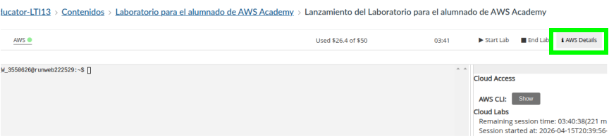



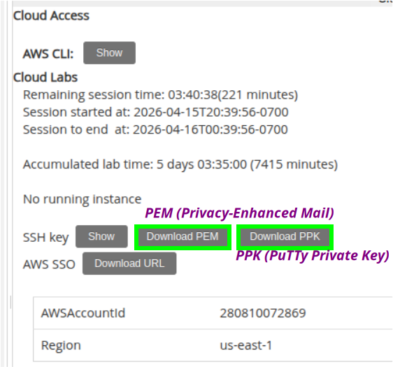


---

Vemos dos tipos de claves privadas, nosotros utilizaremos **PEM**:

- **PEM (Privacy-Enhanced Mail)**  
  Formato estándar de clave privada usado en Linux/Mac para conectarse por SSH (ej. EC2).

- **PPK (PuTTY Private Key)**  
  Formato de clave privada específico de PuTTY (Windows), equivalente al PEM.

---

Descargamos el fichero y cambiamos los permisos.

> * En Linux


    chmod 400 labsuser.pem



---

> * En Windows

Para que la clave funcione correctamente en Windows, debemos restringir los permisos del fichero:

- Clic derecho sobre el fichero `.pem`
- **Propiedades**
- Pestaña **Seguridad**
- Pulsar en **Opciones avanzadas**
- Pulsar en **Deshabilitar herencia**
- Elegir **Quitar todos los permisos heredados**
- Pulsar en **Agregar**
- Seleccionar tu usuario
- Dar permisos de **Lectura**
- Eliminar cualquier otro usuario/grupo si aparece

---

Establecemos la conexión

Localizamos la IP pública para poder conectar:


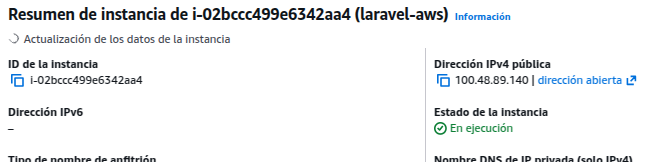


---

Tanto en Windows como en Linux vamos a conectar por SSH (en Windows también se puede usar PuTTY).

En Windows abrimos una **PowerShell**.

El usuario que se crea en este tipo de instancias (Ubuntu) es **ubuntu**, y lo especificaremos en la conexión.

Si tenemos dudas, podemos verlo en el botón **Connect** de la instancia.

En general, los usuarios por defecto son:

| AMI            | Usuario   |
|----------------|----------|
| Ubuntu         | ubuntu   |
| Amazon Linux   | ec2-user |
| Debian         | admin    |
| CentOS         | centos   |
| RHEL           | ec2-user |
| SUSE           | ec2-user |

---

ssh -i labsuser.pem ubuntu@100.48.89.140



---

Nos preguntará si queremos continuar con la conexión:


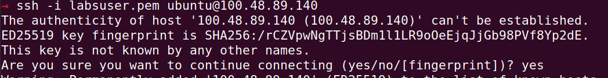


---

Escribimos **yes** y se establecerá la conexión:


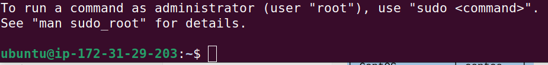


## Instalación de todo el sistema

Ahora vamos a proceder a la instalación de las librerías necesarias para nuestro objetivo.

Primero actualizamos los repositorios de paquetes:


sudo apt update


---

* php y apache2


sudo apt install -y php apache2 libapache2-mod-php


---

* Librerías necesarias para nuestro proyecto de laravel


sudo apt install -y php-mbstring php-xml php-zip php-sqlite3 php-curl php-mysql


---

* composer

Para instalar composer tenemos diferentes opciones. En este caso vamos a descargar el instalador, ejecutarlo con PHP y copiar el ejecutable generado a una carpeta que está en el PATH del sistema con el nombre **composer**.


curl "https://getcomposer.org/installer" -o composer.phar
sudo php composer.phar --install-dir=/usr/local/bin --filename=composer


Tras la instalación podemos verificar la versión (se instalará la última disponible):


composer --version



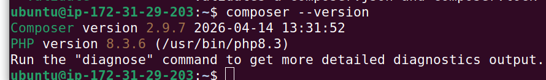


---

* node y npm

En este caso procederemos de forma similar, descargando el script de configuración e instalando Node.js.


curl "https://deb.nodesource.com/setup_22.x" -o node.sh
sudo -E bash ./node.sh
sudo apt install -y nodejs


Igualmente que en el caso anterior, tras la instalación deberemos verificarlo:


node -v
npm -v



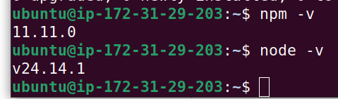


---

Preparar el document root para copiar el proyecto de laravel

Ahora queremos copiar el proyecto de Laravel en la carpeta **/var/www/html**, para lo cual necesitamos permisos de escritura en esa carpeta.

Actualmente esta carpeta es propiedad de **root**, ya que se ha creado durante la instalación de Apache (que hemos hecho con **sudo**).


sudo chown -R ubuntu:www-data /var/www/html


Podemos ver la evolución de propietarios en la siguiente imagen:


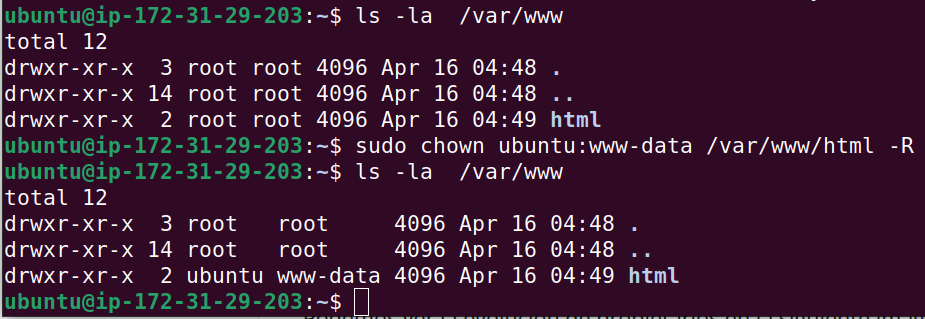  


---

Clonamos el proyecto de laravel<br />


cd /var/www/html
git clone https://github.com/MAlejandroR/laravel_aws.git


Esto nos descargará el proyecto en la carpeta **laravel_aws**, teniendo el directorio:

```text
/var/www/html/laravel_aws


