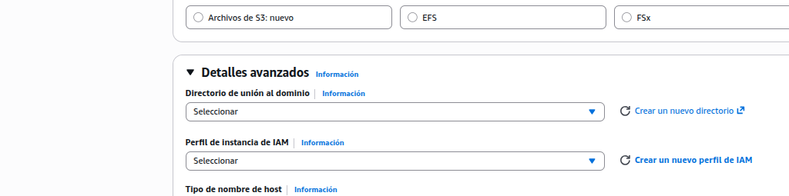
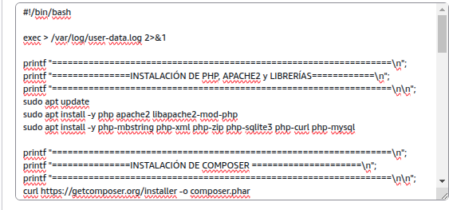
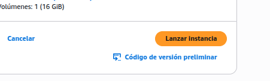

+++
title = 'Crear un shell'
date = 2024-10-15T07:04:49+02:00
draft = false
icon = "fas fa-terminal"
weight = 30
description = "Crear una EC2 básica y desplegar un Laravel"
+++

## Incluir un bash de usuario

Consiste en recoger todas las acciones anteriores y generar un script bash para automatizar la configuración de nuestra EC2.

Otra opción sería crear una AMI a partir de una instancia ya configurada.

Vamos a ir copiando las acciones indicadas, pero antes unos comentarios

---

Debemos indicar al inicio que se trata de un script bash:


#!/bin/bash


También es recomendable guardar toda la salida que genere el script (mensaje de las accione realizadas o mensajes de error) en un fichero de log:

 

exec > /var/log/user-data.log 2>&1

* **2>&1** especifica que los mensajes de error sean reconducidos al standar de salida

---

Añadimos mensajes para facilitar la lectura del proceso de la intencción que se va a realizar a continuación:


printf "=================================================================\n";
printf "===============INSTALACIÓN DE PHP Y APACHE2 =====================\n";
printf "=================================================================\n\n";


---
Una acción complicada es automatizar la modifcacion de un fichero.

En este caso lo que haremos será escribir en el fichero todo lo que necesitemos con la redireccioń **>**

Por ejemplo escribir **Hola** y guardarlo en un fichero llamado **saludo.txt**

echo "Hola "> saludo.txt 


Igualemnte y sol por curiosidad, podemos poner marcas de tiempo para saber cuánto tarda en ejecutarse el script

# Inicio
inicio=$(date +%s)

echo "Inicio del script: $(date)"
# .... El resto del script

fin=$(date +%s)

echo "Fin del script: $(date)"

# Cálculo
duracion=$((fin - inicio))
minutos=$((duracion / 60))
segundos=$((duracion % 60))

echo "Tiempo total: $minutos minutos y $segundos segundos"

En el proceso de instalación y verificación se ha detectado un problema con Composer relacionado con la variable de entorno **HOME**, que es necesario definir explícitamente.

Igualmente, Composer muestra una advertencia al ejecutarse como superusuario (root), ya que por seguridad desactiva los plugins en entornos no interactivos.

Para permitir su ejecución correcta en este contexto (script de User Data), debemos añadir las siguientes variables de entorno antes de ejecutar Composer:


export HOME=/root
export COMPOSER_ALLOW_SUPERUSER=1


---

Otro problema detectado, es que cuando ejectuamos las migraciones en laravel usando sqlite, si no existe el fichero que almacena los datos, laravel, de forma interactiva, nos pide confirmación para crearlo.
Como aquí no vamos a poder interactuar con el script, creamos previamente el fichero con el comando **touch**


touch database/database.sqlite


Igualemnte cuando está, como es el caso, en modo producción, pide confirmación para ejecutar las migraciones, tomando por defecto el valor no

Una opción es forzar la migración sin pedir confirmación
---
Para terminar, hay una cuestión muy importante relacionada con los usuarios.

Por un lado, cuando comenzamos este script con la línea **#!/bin/bash**, debemos ser conscientes de que es el usuario **root** quien ejecuta todas las instrucciones. Por tanto, no es necesario  `sudo` dentro del script.

Por otro lado, cuando clonamos el repositorio o realizamos tareas de desarrollo (como ejecutar `composer` o `npm`), es recomendable hacerlo como el usuario habitual, en este caso **ubuntu**.

Para ejecutar comandos como otro usuario dentro del script, utilizamos:


sudo -u ubuntu -i <<'EOF'

# comandos que se ejecutan como ubuntu

EOF


El uso de `-i` permite simular un login real del usuario, cargando su entorno (`HOME`, `PATH`, etc.), lo cual es especialmente importante para herramientas como Composer o Node.
---
php artisan migrate --seed --force


Con todo esto empezamos a reescribir todas las acciones



#!/bin/bash

exec > /var/log/user-data.log 2>&1

inicio=$(date +%s)

printf "=================================================================\n";
printf "===============INSTALACIÓN DE PHP, APACHE2 y LIBRERÍAS============\n";
printf "=================================================================\n\n";
apt update
apt install -y php apache2 libapache2-mod-php
apt install -y php-mbstring php-xml php-zip php-sqlite3 php-curl php-mysql

printf "=================================================================\n";
printf "===============INSTALACIÓN DE COMPOSER =====================\n";
printf "=================================================================\n\n";
export HOME=/root
export COMPOSER_ALLOW_SUPERUSER=1
curl https://getcomposer.org/installer -o composer.phar
php composer.phar --install-dir=/usr/local/bin --filename=composer
composer --version

printf "=================================================================\n";
printf "===============INSTALACIÓN DE NODE =====================\n";
printf "=================================================================\n\n";
curl https://deb.nodesource.com/setup_24.x -o node.sh
sudo -E bash ./node.sh && sudo apt install -y nodejs
npm -v
node -v

printf "=================================================================\n";
printf "===============CLONAR EL PROYECTO LARAVEL =====================\n";
printf "=================================================================\n\n";

chown -R ubuntu:www-data /var/www/html
chmod -R 775 /var/www/html
cd /var/www/html
sudo -u ubuntu git clone https://github.com/MAlejandroR/laravel_aws.git

printf "=================================================================\n";
printf "===============ORQUETAR, ASSETS, MIGRACIONES, links =====================\n";
printf "=================================================================\n\n";
cd /var/www/html/laravel_aws
sudo -u ubuntu bash <<EOF
composer update
npm install
npm run build
touch database/database.sqlite
php artisan migrate --seed --force
php artisan storage:link

EOF

printf "=================================================================\n";
printf "===============DAR PERMISOS A CARPETAS DEL PROYECTO ==============\n";
printf "=================================================================\n\n";

chown -R ubuntu:www-data /var/www/html/laravel_aws
chown -R www-data:www-data /var/www/html/laravel_aws/storage
chown -R www-data:www-data /var/www/html/laravel_aws/bootstrap/cache

chmod 775 /var/www/html/laravel_aws/storage -R
chmod 775 /var/www/html/laravel_aws/database/database.sqlite -R
# Para las sesiones necesitamos permisos explícitos para www-data

printf "========================================================\n"
printf "===============MODIFICAR EL FICHERO DE CONFITURACIÓN ==============\n";
printf "========================================================\n"
cat > /etc/apache2/sites-available/000-default.conf <<EOF
<VirtualHost *:80>
ServerAdmin webmaster@localhost
DocumentRoot /var/www/html/laravel_aws/public
<Directory /var/www/html/laravel_aws/public>
AllowOverride All
Require all granted
</Directory>
ErrorLog \${APACHE_LOG_DIR}/error.log
CustomLog \${APACHE_LOG_DIR}/access.log combined
</VirtualHost>
EOF

printf "========================================================\n"
printf "===============HABILITAR EL MODO REWRITE Y REBOTAR EL SERVICIO ==============\n";
printf "========================================================\n"
a2enmod rewrite
systemctl restart apache2

fin=$(date +%s)
duracion=$((fin - inicio))
minutos=$((duracion / 60))
segundos=$((duracion % 60 ))

printf "========================================================\n"
printf "=======FIN SCRIPT===============\n"
printf "========================================================\n"
echo "Tiempo total: $minutos minutos y $segundos segundos"


## Crear la instancia con bash

Ahora, siguiendo la práctica anterior, volvemos a crear una ec2, con los mismos parámetros, y accdedmos a la última sección, **Detalles avanzados**

  


Buscamos la última opción y copiamos ahí el script

  


Opcionalmente lo podríamos cargar desde un fichero

Apretamos lanzar instancia


  


La instancia se crea rápidamente,

  


El script tarda un poco en ejecutarse, por lo que la instancia estará en estado inicializándose

  


Podemos entrar en la instanci y ver cómo el fichero de log está ejecutando las acciones


ssh -i labsuser.pem ubuntu@La_ip_publica_de nuestra_instancia

tail -f /var/log/user-data.log


