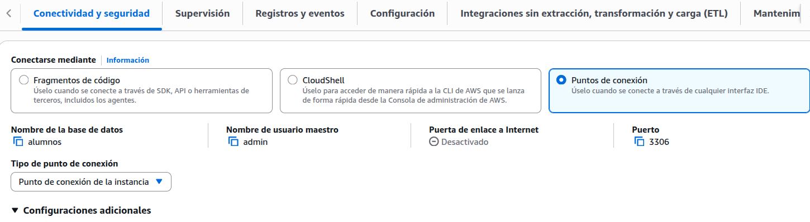
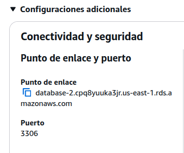
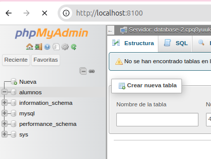

+++
title = 'Acceso a RDS'
date = 2024-10-15T07:04:49+02:00
draft = false
icon = "fas fa-server"
weight = 40
description = "Acceder a la bd"
+++
## Acceder a los servicios

Lo primero que necesitamos el el punto de acceso

Para ello vamos a la opción **Conectividad y seguridad** y seleccionamo **puntos de conexion** 


  


En esa ventana buscamos el punto de enlace

  

Ese es nuestro punto de enlace

Un docker para conectar

Creamos un docker asignando directamente esas credenciales


services:
phpmyadmin:
image: phpmyadmin
ports:
- 8100:80
environment:
- PMA_HOST=database-2.cpq8yuuka3jr.us-east-1.rds.amazonaws.com
- PMA_USER=admin
- PMA_PASSWORD=12345678


 Ahora lanzamos el docker 

docker compose up -d


Podemos abrir el navegador y vemos nuestra base de datos en AWS

  
