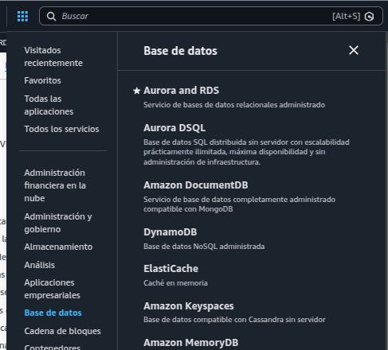
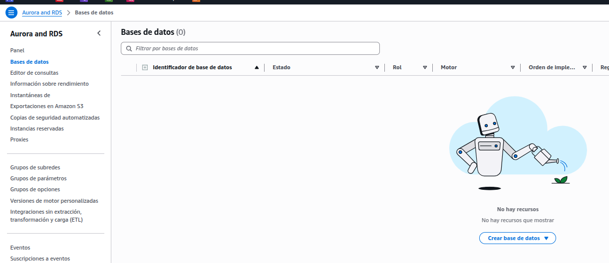
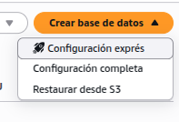
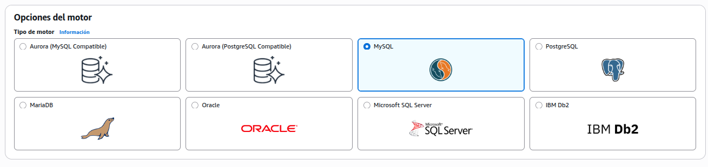
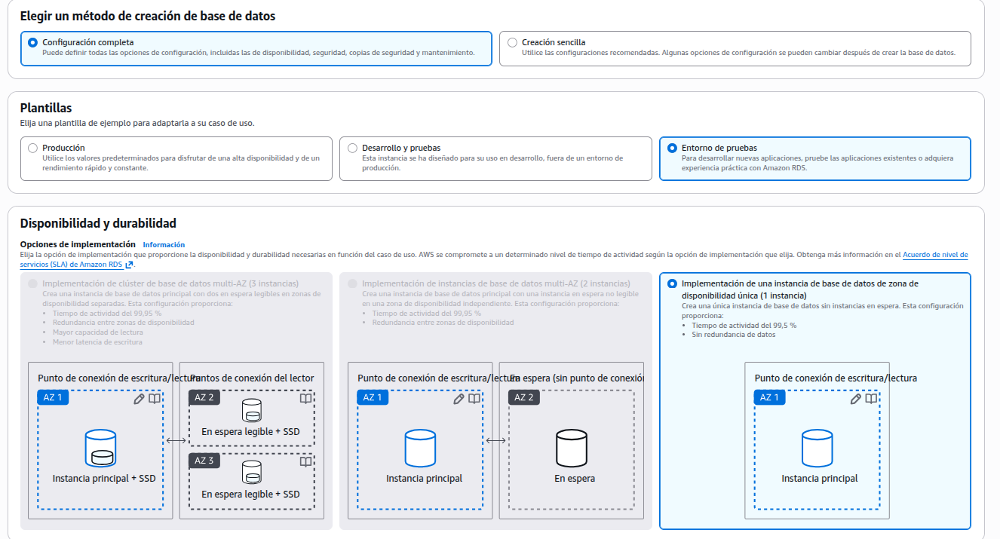
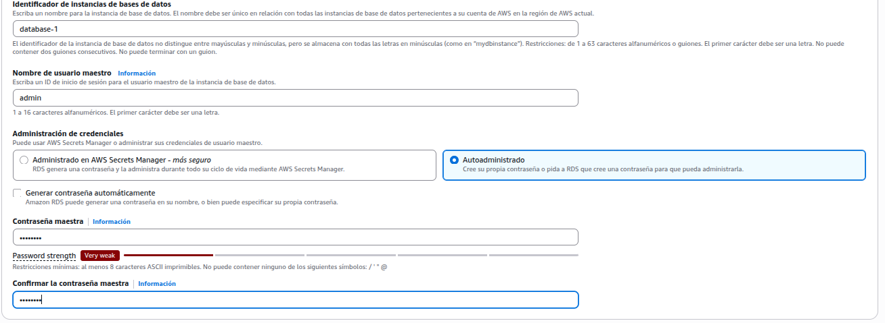
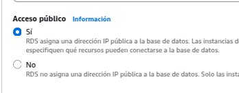
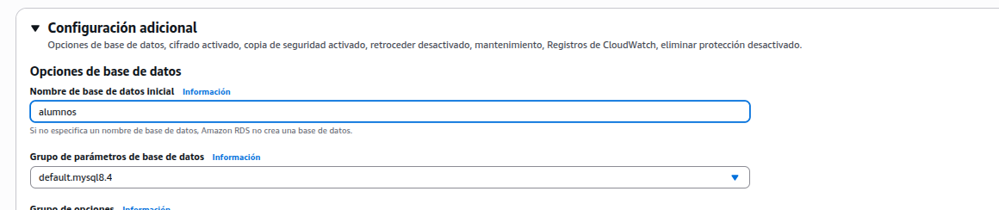
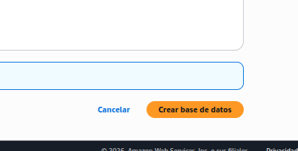
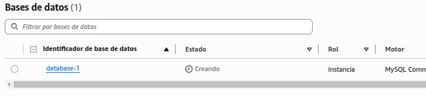

+++
title = 'RDS Bases de datos'
date = 2024-10-15T07:04:49+02:00
draft = false
icon = "fas fa-database"
weight = 40
description = "Crear servicios de BD"
+++
## Acceder a los servicios

Dentro de la consola de AWS accedemos a los servicios de **bases de datos** y seleccionamos **Amazon RDS**.





Accederemos al **panel de control (dashboard)** del servicio.

---

## Crear una base de datos

Tenemos diferentes tipos de bases de datos.

Vamos a trabajar con bases de datos relacionales que son las que manejamos habitualmente

En el menú lateral, seleccionamos **Bases de datos** y pulsamos el botón **Crear base de datos**.





Seleccionamos la opción Base de datos y apretamos el botón **crear base de datos** seleccinando **configuración completa**

  


### Configuración del servicio
Ahora vamos a ir viendo y entendiendo las diferentes opciones que se presentas

A diferencia de las instancias EC2 dónde selecinamos un AMI, aquí seleccionamos el motor de la base de datos que vamos a utilizar.
Lo primero seleccionamos lo que se llama el **sabor** o el motor de la base de datos que queremos utilizar

En nuestro caso seleccionaremos **MySQL**




Opciones de configuración 

Seleccionamos en la siguiente opción una configuracion completa y en modo de pruebas y así veremos diferentes opciones.
Seleccionamos modo de de pruebas, que implica que no habrá replicacion y por lo tanto será mucho más económico (se puede ver gráficamente en la imagen que le acompaña)




Usario y contraseña

Las siguientes opciones son muy importantes, ya que van a permitir acceder a la base de datos.

En ella especificaremos el usuario, que por defecto indican **admin** y la password, dándonos diferentes opciones para generarla

En nuestro caso vamos a poner **12345678** por comodidad y ya que la base de datos no se va a quedar en ejecución mucho tiempo (es una práctica de laboratorio)

  


No es lo más habitual, pero ahora vamos a dar acceso públic a esta base de datos para poder acceder a ella


  

El resto de opciones las dejamos por defecto y vamos a **Configuración adicional**  donde podemos seleccionar el nombre de la base de datos

  


Ya podemos dar a crear **la base de datos**, acción que puede tardar entre 2 y 4 minutos

  


Vemos que la instancia se está creando

  
