+++
title = 'S3'
date = 2024-10-15T07:04:49+02:00
draft = false
icon = "fas fa-store"
weight = 40
description = "Servicio de bukets S3"
+++
## Acceder a los servicios

Dentro de la consola de AWS accedemos a los servicios de **S3**, y seleccinamos crear un bukets


  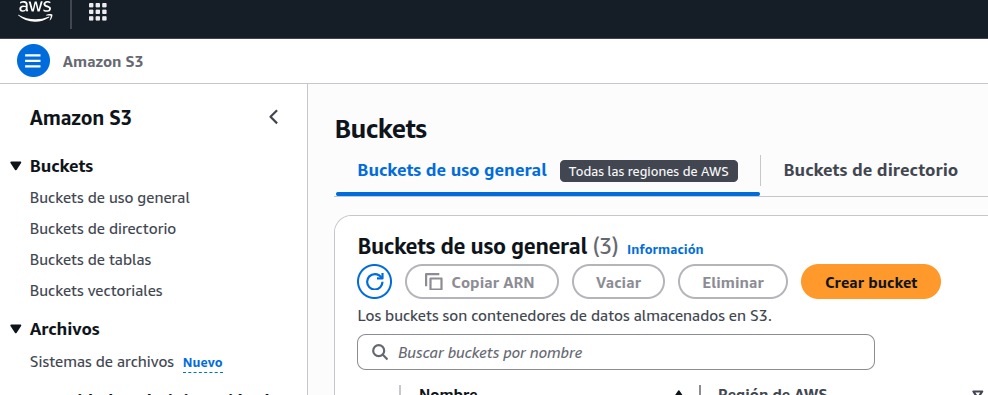


Dejamos las opciones por defecto y asignamos un nombre único al bucket, ya que los nombres en S3 son globales y no pueden repetirse en ninguna cuenta de AWS.

En nuestro caso asignamos **2048-aws**


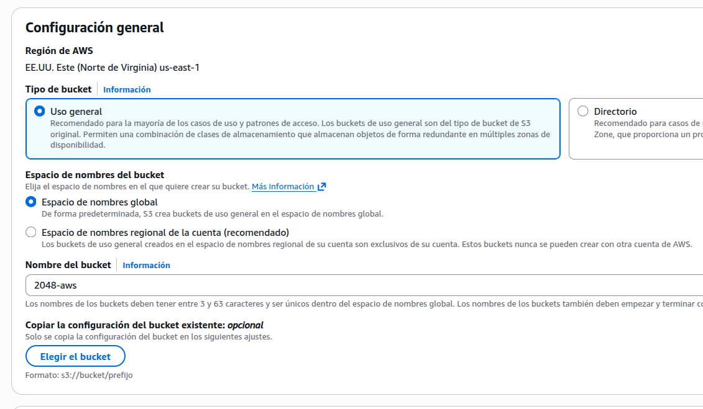


Acceso público

Como vamos a hacer una web estática, dejamos acceso público el cual hay que confirmar


  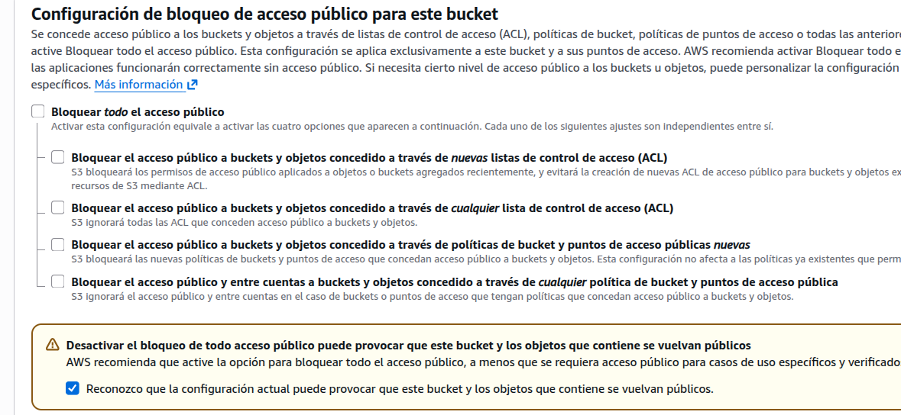

Con estas opciones seleccionamos crear el bukets

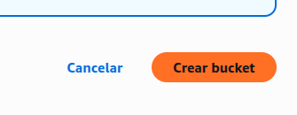  


## Subiendo ficheros
Ahora vamos a subir una web estática que tenemos disponbile en git, que es un sencillo juego de js llamado 2048

Primero lo podemos clonar en local


git clone https://github.com/MAlejandroR/2048.git


Ahora dentro del bucket seleccionamos **Cargar**, que es subir ficheros

  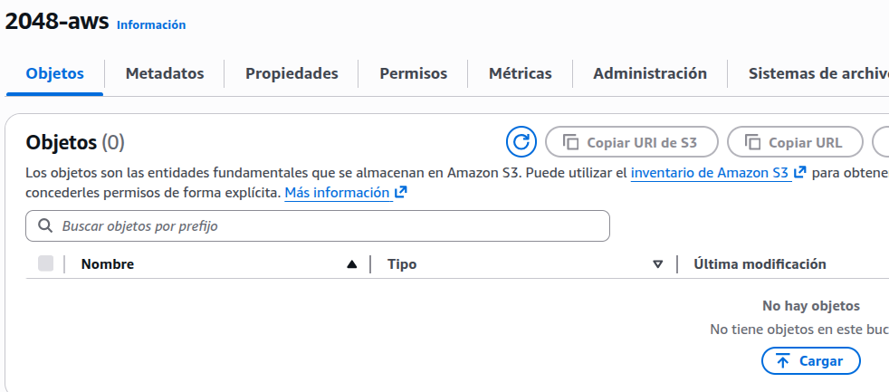


Dentro de la ventana que nos muestra, tenemos botones para subir ficheros o carpetas

Para poder acceder posteriormente bien al proyecto es mejor subir el contenido no la carpeta entera, esto implica subir por un lado los ficheros, y por otro, cada una de las carpetas

Para proceder a la carga definitiva, hay que realizar la acción indicada


  


Al final tendremos todo subido

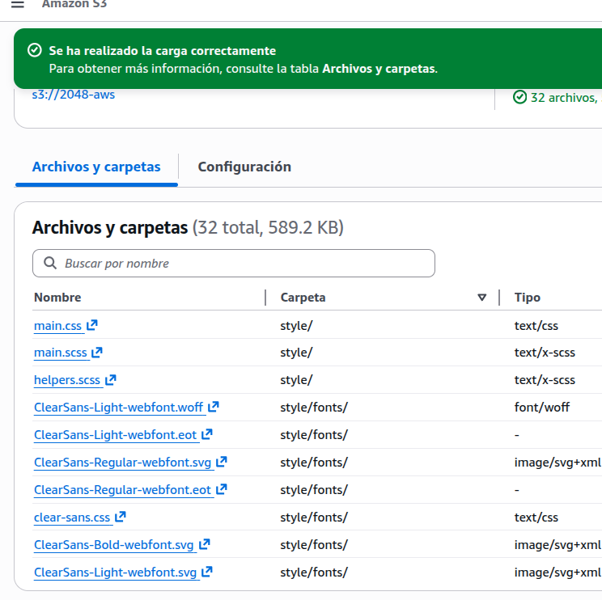


Para hacerlo una web estática, tenemos que ir a propiedades en el dasboard de este bucket


  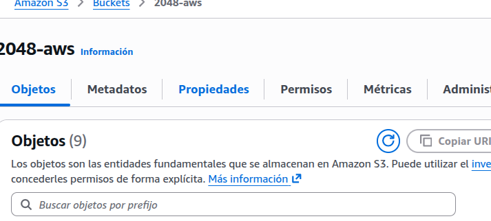


Justo en la parte inferior de la página tenemos el acceso a **Web Static**, ahí presionamos editar

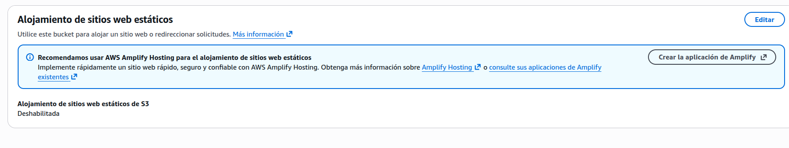  


Simplemente habilitamos y especificamos el nombre del index.html y un fichero en el caso de errores

  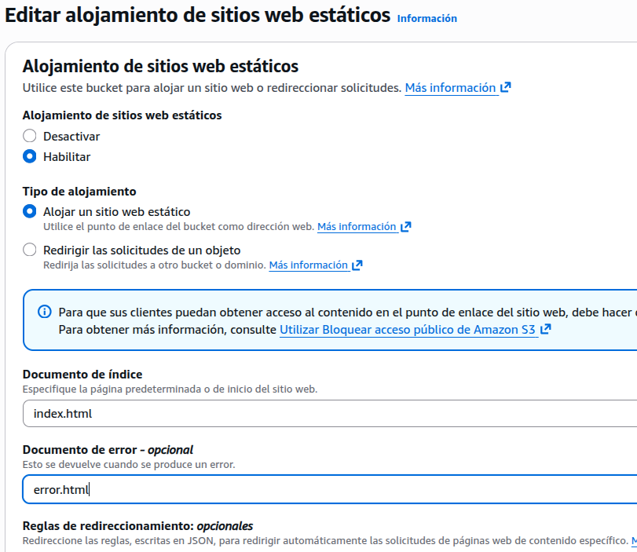


Guardamos cambios


  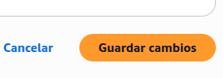


Para terminar tenemos que ir a políticas y especificar unas políticas para este web site

  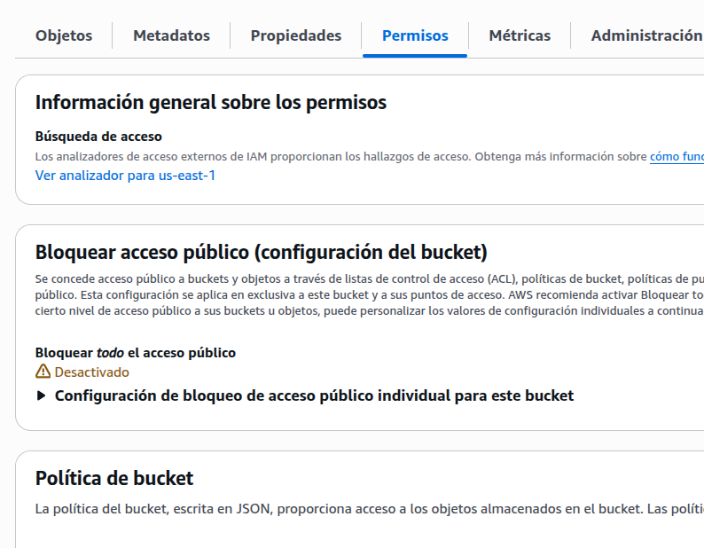


Hay que copiar este fichero json que establece políticas de acceso a este bucket.Debes de especificar el nombre del bucket concreto.En nuestro caso es **2048-aws**, pero modifícalo según sea tu nombre





Ahora  en el dashboard del S3, copiamos la url (previo selecionamos el index) y podremos acceder a nuestro bucket en la red


  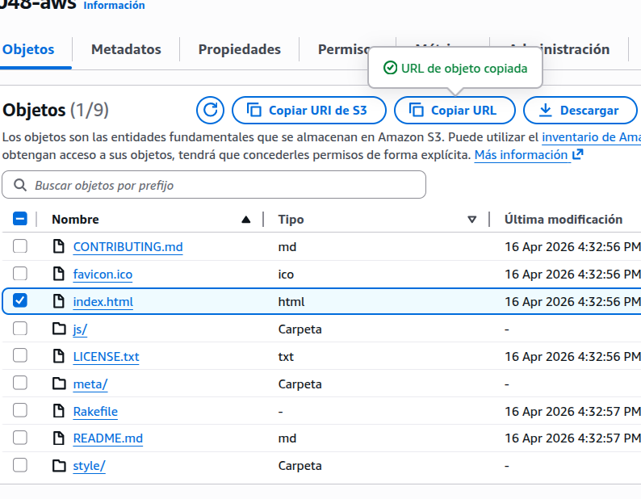
